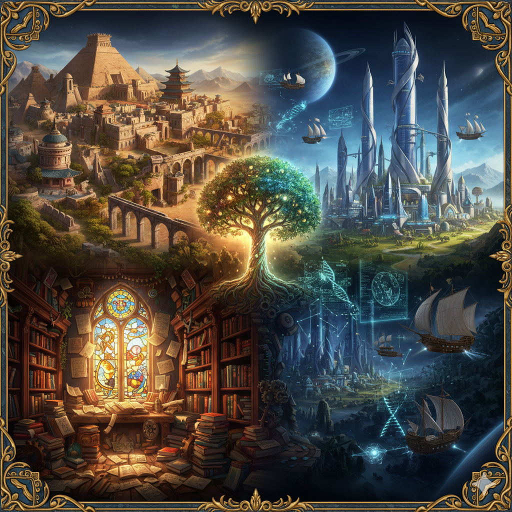
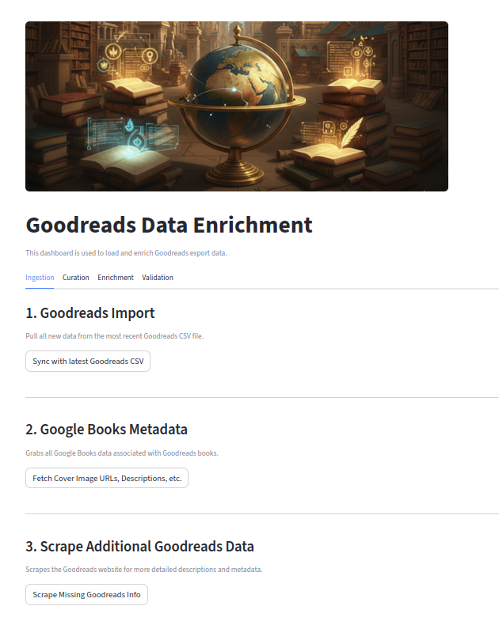
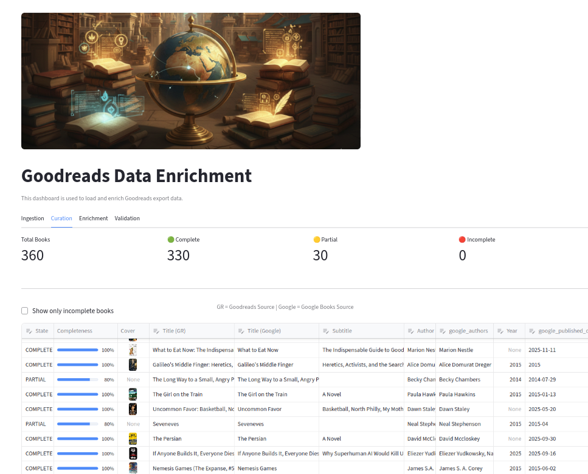
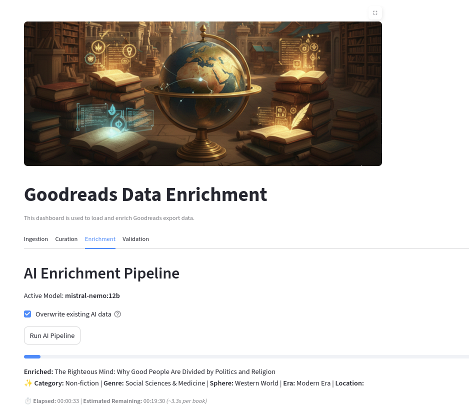
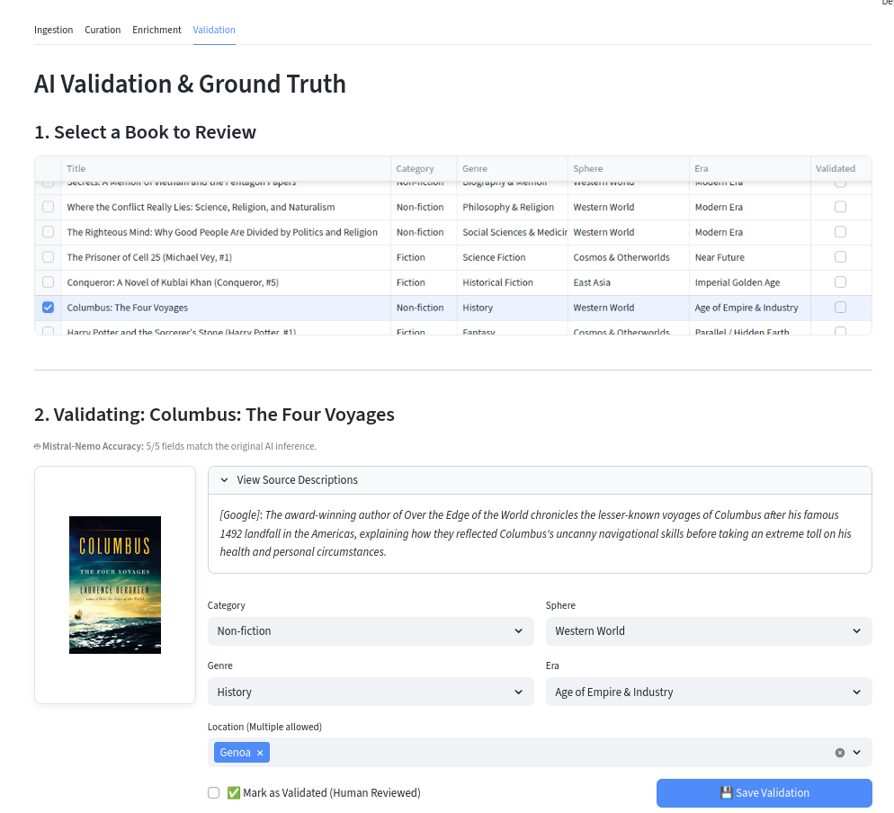
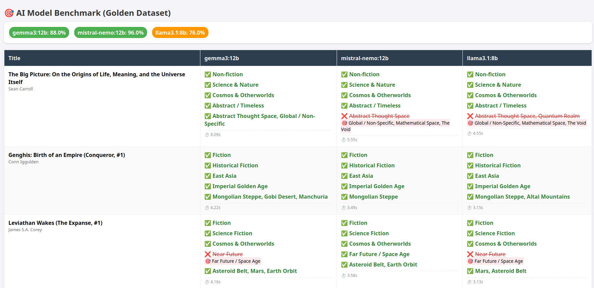

# Goodreads Data Enhancer

This project is all about enhancing and visualizing your Goodreads export data. Because Goodreads export data is fairly sparse (it doesn't include book descriptions or tags), this app adds additional data from Google Books, some additional scraping of Goodreads, and LLM inference for even more detailed metadata.

The most interesting part of this project is the AI enrichment, which uses local LLM inference (ollama) to generate tags and summaries for your books. It essentially uses chain-of-thought prompting to determine elements such as genre, era, locations, etc. I've include an "experiment_runner" script in which you can compare a number of different models to see what works best for your use case.

At this point the project includes completed modules for all the data enhancement functions, which can be run through the command line or through the Streamlit dashboard. I've also included logging for each module. 

A secondary goal will be to add another dashboard that includes metrics, visualizations, and a semantic similarity graph to help you better understand your reading collection.


## Table of Contents
- [Goodreads Data Enhancer](#goodreads-data-enhancer)
  - [Table of Contents](#table-of-contents)
  - [Project Structure](#project-structure)
  - [Getting Started](#getting-started)
    - [Python Dependencies](#python-dependencies)
    - [Installation](#installation)
  - [Data Dashboard](#data-dashboard)
    - [Ingestion (Tab 1)](#ingestion-tab-1)
    - [Curation (Tab 2)](#curation-tab-2)
    - [AI Enrichment (Tab 3)](#ai-enrichment-tab-3)
    - [Validation (Tab 4)](#validation-tab-4)
  - [Data Enrichment Steps](#data-enrichment-steps)
    - [Step 1: Goodreads Ingestion \& Data Structuring](#step-1-goodreads-ingestion--data-structuring)
      - [Overview](#overview)
      - [Technical Description](#technical-description)
      - [How-to Run](#how-to-run)
    - [Step 2: Google Books Metadata Enrichment](#step-2-google-books-metadata-enrichment)
      - [Overview](#overview-1)
      - [Technical Description](#technical-description-1)
      - [How-to Run](#how-to-run-1)
    - [Step 3: Goodreads Web Scraping (Gap Filling)](#step-3-goodreads-web-scraping-gap-filling)
      - [Overview](#overview-2)
      - [Technical Description](#technical-description-2)
      - [How-to Run](#how-to-run-2)
    - [Step 4: AI Enrichment \& Thematic Analysis](#step-4-ai-enrichment--thematic-analysis)
      - [Overview](#overview-3)
      - [Technical Description](#technical-description-3)
      - [How-to Run](#how-to-run-3)
  - [Model Evaluation / Benchmarking](#model-evaluation--benchmarking)
    - [Overview](#overview-4)
    - [Technical Description](#technical-description-4)
    - [How-to Run](#how-to-run-4)
  - [Enrichment Categories Discussion](#enrichment-categories-discussion)
    - [Fiction / Non-fiction](#fiction--non-fiction)
    - [Genre](#genre)
    - [Spheres](#spheres)
    - [Eras](#eras)
    - [Locations](#locations)
  - [Acknowledgments \& Collaboration](#acknowledgments--collaboration)


## Project Structure
```
BookNet/
├── data/
│   ├── enrichment/       # JSON knowledge bases
|   |   ├── eras.json
|   |   ├── locations.json
|   |   ├── spheres.json
|   |   └── top_level_genres.json
│   ├── raw/
|   |    └── *_goodreads_library_export.csv  # input file
|   ├── processed/
|   |    └── my_library.json  # primary output file
|   ├── evals/
|   └── logs/
|   
├── pipeline/
│   ├── goodreads_csv_extractor.py
│   ├── googlebooks_enhancer.py
|   ├── goodreads_extractor.py
|   ├── ai_enrichment.py
|   └── category_loader.py
│    
├── config.py             
├── data_dashboard.py     # Main Entry Point (Streamlit)
├── experiment_runner.py  # Evaluation Script
├── requirements.txt      
└── README.md
```

## Getting Started

### Python Dependencies
* Core libraries: ```pandas```, ```requests```, ```beautifulsoup4```
* Web interface: ```streamlit```
* AI/ML: ```ollama```

### Installation
1. **Clone the repo**
   ```bash
   git clone https://github.com/t-pegors/booknet.git
   cd booknet
   ```

2. **Set up virtual environment**
   ```bash
   python -m venv venv
   source venv/bin/activate  # On Windows: venv\Scripts\activate
   ```

3. **Install dependencies**
   ```bash
   pip install -r requirements.txt
   ```

4. **Set up secrets**
   ```bash
   cp .env_TEMPLATE .env
   # Edit .env with your Google Books API key
   ```

5. **Start Ollama server** (for AI enrichment)
   ```bash
   ollama serve
   # Pull required models: ollama pull mistral-nemo:12b
   # You can pull multiple models and test them in the experiment runner
   ```

6. **Export Your Goodreads data**
   * Go to https://www.goodreads.com/review/import and export your reading history as a CSV file.
   * Place the CSV file in the `data/raw/` directory.
   * Adjust the paths in `config.py` to match your CSV file name.

7. **Run the application**
   ```bash
   # Start the Streamlit dashboard (recommended)
   streamlit run data_dashboard.py

   # Or use the command line pipeline
   python main.py
   ```

## Data Dashboard

The data dashboard is a Streamlit application that allows you to walk through the data enrichment process step by step.

---

### Ingestion (Tab 1)



This tab contains all of the major steps in which data is pulled from Goodreads, supplemented by hitting Google Books, and then, if needed, furthur supplemented by reaching out to the Goodreads website. All of the steps on this page are fully automated and can be run in sequence.

Note that the Google Books API can take a number of minutes to complete, depending on the size of your dataset. 

---

### Curation (Tab 2)



This tab shows you the results from the ingestion step. In the table, you'll find the important metadata from both Goodreads and Google books. The "completeness" score looks, for example, for a title or author from EITHER datasource - as long as there is one datasource for each element, the element is counted as complete. The primary reason for an "partial" rating will be the lack of a cover image. 

Note that you can edit directly into the table. Any changes you make will be saved to the database. So for example, you can find your own URL for a cover image, hit save, and the table will automatically update.

It's important to get the metadata as complete as possible for the AI enrichment step (essentially, all of the data except for cover URL is important). This mean title, author, original publication year, and categories / tags, and description. 

---

### AI Enrichment (Tab 3)



This steps applies your LLM of choice to each book in your dataset, adding additional fields such as genre and era (see below for more info). This step takes the LONGEST, but note that it will save out its results every 10 books, so if it crashes, you won't lose too much progress.

---

### Validation (Tab 4)



LLM-generated data always needs to be validated. This tab allows you to review the AI-generated data and make corrections if needed. Click on the row containing the book you want to validate and it will expand the AI outputs. Each output contains a dropdown menu that allows you to change the results, if you disagree with the AI's output. Clicking the "save" button will save the changes to the database. Make sure to also click "validate" once you've checked the book, such that you can keep track of your progress. 

## Data Enrichment Steps

### Step 1: Goodreads Ingestion & Data Structuring

#### Overview

THis step transforms raw CSV rows into a nested dataclass architecture.

By structuring the data into distinct "source containers" from the moment of entry, the application ensures that original Goodreads metadata is never overwritten or polluted by subsequent enrichment steps—like API lookups or AI analysis.

#### Technical Description

The ingestion process is governed by three core pillars: Object-Relational Mapping (ORM), Data Sanitization, and Non-Destructive Merging.

**1. Nested Dataclass Architecture**
At the heart of the module is the "Book" master class. It acts as a container for three specialized sub-dataclasses:

* GoodreadsData: Captures the 24+ columns provided by the export (ratings, dates, etc.).
* GoogleBooksData: A pre-allocated slot for future metadata enrichment (thumbnails, subtitles).
* LLMData: A placeholder for AI-generated insights (thematic spheres, eras, and genres).

**2. Robust Data Sanitization**
CSV data is often "dirty," especially when exported from web platforms. The module employs several helper functions to ensure data integrity:

* ISBN Cleaning: The "clean_isbn" function strips Excel-style formatting (e.g., ="1234") to return pure numeric strings.
* Safe Type Casting: Functions like "get_int" and "parse_year" prevent the entire pipeline from crashing if a field contains unexpected empty values or "NaN" (Not a Number) markers.
* Logic Filtering: The "load_and_filter_csv" function isolates books marked as "read," ensuring the dashboard remains focused on completed works.

**3. State-Preserving Merge Logic**
The "merge_books" function is critical for app persistence. When you import a new CSV, the module:

1. Loads the existing "library.json" file.
2. Matches books by their unique Goodreads ID.
3. Updates the Goodreads-sourced metadata.
4. Preserves any existing Google Books or LLM data already stored in the library.

This "Update-and-Preserve" strategy allows you to refresh your reading list without losing the expensive enrichment data—like API calls and LLM tokens—you’ve already gathered for those titles.

#### How-to Run
This step can be run in one of three ways: 
1. As a standalone script: ```python utils/goodreads_csv_extractor.py```
2. Through the main application (As the first of four steps): ```python main.py```
3. Through the web interface

### Step 2: Google Books Metadata Enrichment

#### Overview

Once your reading list is structured, the Google Books enhancer adds additional details like cover images, and mostly importantly, the description information. 

This module acts as a bridge between your local library and the massive Google Books database. It programmatically searches for each book and populates the previously empty `GoogleBooksData` slot within your library objects.

#### Technical Description

The enhancement process is designed for precision, efficiency, and data safety, utilizing several key software patterns:

**1. Dual-Tier Search Strategy**
To ensure the highest accuracy, the module employs a tiered lookup logic:

* **Tier 1: ISBN Match:** The script first attempts to find the book using the `ISBN13` or `ISBN10` provided by Goodreads. This is the most reliable way to ensure the metadata matches your specific edition.
* **Tier 2: Fuzzy Fallback:** If the ISBN fails, the script falls back to a combined query of `intitle` and `inauthor`. It also includes a "title cleaning" step that strips subtitles to improve the likelihood of a match in the Google database.

**2. Rate Limiting and Resilience**
Interacting with a public API requires "good neighbor" behavior. The module includes built-in safeguards:

* **Throttle Control:** A mandatory `time.sleep` interval is placed between requests to keep the app within the 5 calls/second threshold.
* **Error Handling:** The script specifically watches for `429` (Too Many Requests) errors. If hit, it pauses the entire process for 5 seconds to let the rate limit reset before continuing.

**3. "Raw Data" Archiving**
One of the most robust features of this module is that it doesn't just extract what it needs; it saves the **entire JSON response** from Google into a `raw_data` field.

* This means that if you decide to add new features later (like page dimensions or maturity ratings), you won't need to re-run your API calls. The data is already stored locally in your `library.json`.

**4. Progressive Persistence**
To protect against power outages or network failures during a long import, the script doesn't wait until the end to save.

* **Memory-First Processing:** The core logic is decoupled from the hard drive, processing books in-memory for speed.
* **Checkpoint Saving:** A callback function triggers a disk write every 10 books, ensuring that your progress is consistently cached.

#### How-to Run
This step can be run in one of three ways: 
1. As a standalone script: ```python utils/googlebooks_enhancer.py```
2. Through the main application (As the second of four steps): ```python main.py```
3. Through the web interface


### Step 3: Goodreads Web Scraping (Gap Filling)

#### Overview

Even with a robust API integration like Google Books, some titles—particularly rare editions, indie publications, or older out-of-print works—may lack the description field. This step acts as a fail-safe, by programmatically visits the original Goodreads book page to extract descriptions directly from the source HTML, from any books that did not have a description in Google Books.

#### Technical Description

The recovery process focuses on Ethical Automation, Adaptive Parsing, and Persistence.

**1. Ethical Automation & Rate Limiting**
To ensure the script acts as a responsible guest on the web, it employs several "Polite Automation" techniques:

* **Browser Emulation:** The script utilizes standard HTTP headers (User-Agents) to ensure the request is rendered correctly by the server.
* **Jittered Request Spacing:** Rather than a rapid-fire approach, the module uses a randomized "jitter" delay (`2.5` to `4.5` seconds). This ensures the traffic pattern remains within the realm of normal human browsing speeds.
* **Resilience Buffers:** If the script encounters a temporary connection limit (Status 403), it is programmed to enter a "cooldown" phase for 15 seconds, allowing the network state to stabilize before retrying.

**2. Adaptive DOM Parsing**
Web structures are dynamic, and the module is built to handle layout shifts gracefully. Using **BeautifulSoup**, the script employs a multi-tier search strategy:

* **Primary Selector:** It targets modern schema attributes (such as `data-testid`) used in current web designs.
* **Legacy Fallback:** If the primary selector fails, the script automatically pivots to older ID-based selectors. It is specifically calibrated to handle "Read More" expansion toggles to ensure the full, unabridged description is captured.

**3. "Lazy" Extraction Logic**
Efficiency is a core requirement. The module is "lazy" by design, meaning it only initiates a network request if:

1. The `GoodreadsData` description is currently empty.
2. The `GoogleBooksData` enrichment step from Step 2 also failed to find a summary.

By prioritizing existing API data first, the script minimizes unnecessary network traffic and speeds up the overall pipeline.

**4. High-Frequency Persistence**
Given the slower pace of ethical web navigation, the script utilizes a **Progressive Save** pattern. Every 5 successful recoveries, the library is committed to disk. This ensures that in the event of a network interruption, the gathered data is never lost.

#### How-to Run
This step can be run in one of three ways: 
1. As a standalone script: ```python utils/goodreads_scraper.py```
2. Through the main application (As the second of four steps): ```python main.py```
3. Through the web interface

### Step 4: AI Enrichment & Thematic Analysis

#### Overview

This is the fun part and the part in which you as a user are going to need to do a lot of tweaking to get your desired behavior (even though it's considered the "intelligence" phase of the pipeline). While the previous steps gathered raw data, the AI enrichment  module uses a Large Language Model (via Ollama) to synthesize that data into meaningful historical and geographical categories.

The goal of this step is to move beyond standard library classification and instead categorize books into Spheres of Influence (world regions) and Eras (specific time periods), allowing your reading history to be visualized as a journey through human civilization.


#### Technical Description

The module implements a sophisticated **Chain-of-Thought (CoT)** pipeline that breaks down complex literary analysis into five distinct, logical steps.

**1. Multi-Step Inference Pipeline**
Rather than asking the AI to classify everything at once, the `enrich_book` function executes a sequential workflow. Each step provides context for the next:

* **Step 1 (Classification):** Determines if the book is Fiction or Non-fiction.
* **Step 2 (Genre):** Selects a specific genre from a predefined, validated list.
* **Step 3 (Sphere):** Assigns the book to a major world region (e.g., East Asia, the Global South, or The Cosmos).
* **Step 4 (Era):** Pins the book to a specific historical period defined uniquely for that Sphere.
* **Step 5 (Location):** Identifies specific primary settings from an approved global location menu.

**2. Reasoning & Transparency**
The script is designed to support "Reasoning Models" (like DeepSeek or Phi-4). I've added some config variables specifically set to turn on or off reasoning tags - forcing the model to reason before it comes up with it's answer. I played with these a lot with both reasoning and non-reasoning models (see model evaluation below), but for me, turning OFF these reasoning tags worked best.

* **Transparency:** These "thoughts" can be extracted and logged, allowing you to see *why* the AI chose "The Ottoman Empire" over "The Western World" for a specific title.
* **Metric Tracking:** If enabled, the script tracks the processing time for every individual step, providing a detailed breakdown of performance across your library.

**3. Constrained Output & JSON Recovery**
To ensure the data can be used programmatically, the module enforces strict output formats:

* **Validated Menus:** The AI is provided with a "menu" of approved categories, eras, and locations. This prevents the model from hallucinating or making up its own naming conventions.
* **Regex-Based Recovery:** LLMs occasionally wrap their answers in conversational text. The `clean_and_parse_json` function uses regular expressions to hunt for the JSON block within the response and extract it safely.

**4. Local Infrastructure (Ollama)**
By utilizing a local Ollama instance, the pipeline maintains high privacy and zero API costs.

* **VRAM Persistence:** The `keep_alive` configuration ensures the model stays loaded in your GPU memory between calls, significantly reducing the latency usually associated with loading large AI models.

#### How-to Run
This step can be run in one of four ways: 
1. As a standalone script: ```python utils/ai_enrichment.py```
2. Through the main application (As the second of four steps): ```python main.py```
3. Through the model evaluation script: ```python utils/experiment_runner.py```
4. Through the web interface

## Model Evaluation / Benchmarking



### Overview

The ```experiment_running.py``` script allows you to test and compare various models on your data. To use this script, you MUST construct a `golden_dataset.json` file that contains the expected outputs for your test books (```data/processed/golden_dataset_TEMPLATE.json```).  By comparing AI outputs against a collection of books manually verified as "ground truth"—the script generates objective accuracy scores across different LLMs.

The script is designed to directly compare models against each other in a benchmarking setup, allowing you to test multiple models (e.g., `phi4` vs. `deepseek-r1`) on the same set of books to determine which one best understands your library's specific taxonomy.


### Technical Description

The evaluation script functions as a systematic testing harness, utilizing a Load -> Infer -> Score -> Visualize lifecycle.

**1. Golden Dataset Alignment**
Before testing begins, the script performs a "join" operation between your local library and the `golden_dataset.json`.

* **Title Matching:** It maps titles from the golden set to your library objects.
* **Randomized Sampling:** To keep testing efficient, you can define a `SAMPLE_SIZE` (e.g., 20 books). The script randomly selects a subset of matches, ensuring your benchmarks are diverse and not biased toward specific genres or eras.

**2. Robust Scoring Logic (`check_match`)**
The accuracy of the benchmark depends on how "correctness" is defined. The `check_match` function is built to be resilient:

* **String Normalization:** It handles basic whitespace and casing issues.
* **Intersection Logic (List Support):** For the location field, where a book might have multiple correct settings, the script performs a set intersection. If the AI identifies *any* of the locations listed in the golden truth, it is awarded a point.
* **Boolean Aggregation:** Every book has 5 target fields. The script tracks points earned vs. total possible points to calculate a final percentage score for the model.

**3. Multi-Model "Arena" Execution**
The script iterates through a list of `MODELS_TO_TEST`, running the entire enrichment pipeline for each model sequentially.

* **In-Memory Tracking:** All results—including the AI's answers, the golden truth, and the raw "Reasoning" text—are stored in a structured master JSON object.
* **Metric Capture:** If enabled, the script captures the per-step timing metrics, allowing you to compare not just the **accuracy** of models, but their **efficiency** (e.g., "Model A is 2% more accurate but 4x slower").

**4. Automated Visual Reporting**
To make the data actionable, the script automatically generates a standalone **HTML Evaluation Report**.

* **Visual Diffs:** Correct answers are highlighted in green, while mismatches show a red "strikethrough" of the AI's answer next to the golden "target" value.
* **Reasoning Logs:** If reasoning is enabled, the report embeds the model's "internal thoughts" directly under each field, making it easy to debug why a model hallucinated or failed.
* **Score Banner:** A high-level dashboard at the top of the report uses color-coded badges to show the final accuracy percentage for every model tested.

### How-to Run
This step must be run on the command line:  ```python utils/experiment_runner.py```
It will automatically generate an HTML report, and store the html, raw json, in the ```evals``` directory. 

## Enrichment Categories Discussion

My prompt to the LLM for each book is a chain-of-thought reasoning stream in which I force the model to make broader categorizations before making more specific ones, each feeding into the next level.


### Fiction / Non-fiction

This is an obvious categorization that I wanted to include as a first step. Making this determination then leads the model to separate options for genre categorization. 

### Genre

The genres I picked are entirely based on my own reading habits. Certain genres are missing that I simply don't read. To create these lists, I looked at a number of categorization websites and just went with what felt like the appropriate level of detail for my own library. To add or edit the genre lists, edit the file `data/enrichment/top_level_genres.json`.

```
{
    "Fiction": [
        "Fantasy",
        "Science Fiction",
        "Horror",
        "Thriller & Suspense",
        "Mystery & Crime",
        "Historical Fiction",
        "Literary Fiction",
        "Contemporary Fiction",
        "Young Adult",
        "Children's",
        "Graphic Novel"
    ],
    "Non-fiction": [
        "Biography & Memoir",
        "History",
        "Science & Nature",
        "Technology",
        "Social Sciences & Medicine",
        "Politics & Current Events",
        "Philosophy & Religion",
        "Travel & Adventure",
        "True Crime",
        "Arts & Culture",
        "Reference & Education"
    ]
}
```

### Spheres

As I thought about attempting to classify my books by eras, I quickly realized that eras are completely dependent on the cultural and geographical location of the book. Because of this, I decided to first have the LLM make a broad generalized classification of the book's "sphere", such that I could then lead the LLM in the next step to pick an era more appropriate to the location of the book. To help the LLM undrstand each sphere, I also allowed Google Gemini to help create a literary description of each sphere. I'm still struggling with how best to deal with non-fiction books that don't have a specific location or books that span the whole of human history. I don't always just want to revert back to the author's cultural background or location of writing, because that doesn't always reflect the actual content of the book.

```
{
  "Western World": {
    "description": "A historical arc tracing the rise of European civilization and its global expansion. This sphere encompasses the classical foundations of Ancient Greece and Rome, the fractured feudal systems of the Middle Ages, and the cultural explosion of the Renaissance. Crucially, it incorporates the geopolitical weight of Russia, anchoring the events of the Russian Revolution, the Soviet Union's role in the World Wars, and the Cold War firmly within the Western narrative. It follows the trajectory of Western powers through the Age of Empire, the Industrial Revolution, and the violent shifts of the 20th century, focusing on the evolution of democracy, conflict, and the Euro-Atlantic hegemony."
  },
  "East Asia": {
    "description": "A timeline defined by the enduring legacy of the Sinosphere and its neighbors. This sphere captures the long continuity of Chinese dynastic rule—from the Warring States to the Qing—and the distinct cultural evolutions of Japan and Korea. It explicitly includes the thundering expansion of the Mongol Empire under Genghis Khan, positioning the Mongol Invasions as a pivotal chapter within the Imperial Golden Age that bridged the Song and Ming dynasties. Stories here traverse the philosophies of Confucianism, the martial codes of the Shogunate, and the explosive economic resurgence of the modern Asian Century."
  },
  "Middle East & South Asia": {
    "description": "The crossroads of the ancient world and the cradle of diverse civilizations. This sphere spans the Fertile Crescent to the Indus Valley, covering the monumental history of Ancient Egypt, Mesopotamia, and Persia, alongside the Vedic, Indic, and classical empires of India. It acts as the primary anchor for the Islamic World, highlighting the intellectual brilliance of the Islamic Golden Age and the might of Gunpowder Empires like the Ottomans and Mughals. Narratives here are woven with the threads of the Silk Road, the birth of major world religions (Abrahamic and Dharmic), and the complex struggle for independence from colonial rule."
  },
  "Global South & Indigenous": {
    "description": "A celebration of the vast, diverse civilizations that flourished outside the traditional Western and Asian power centers. This sphere encompasses the wealthy empires of Sub-Saharan Africa (such as Mali and Great Zimbabwe) and the complex societies of the pre-Columbian Americas (Maya, Aztec, Inca). It honors the oral histories, spiritual connections to the land, and trade networks of Indigenous peoples across continents. The timeline acknowledges the tragic interruption of the Colonial Era and the Transatlantic Slave Trade, while focusing on the resilience, independence movements, and cultural resurgence of Latin America and Africa."
  },
  "Cosmos & Otherworlds": {
    "description": "Encompasses settings beyond standard Earth geography and history. For fiction, this includes deep space, futuristic sci-fi, parallel dimensions, urban fantasy, and entirely fabricated magical realms. For non-fiction, this is the designated sphere for theoretical sciences, cosmology, mathematics, and pure philosophy that exist outside of a specific human timeline or geographic location."
  }
}
```

### Eras

For each sphere, I had Google Gemini create a list of eras that would be appropriate for that sphere. Additionally, I had it generate sub-lists of specific events related to those eras, to give the LLM more context when trying to classify a book. It does NOT pick an item from the sub-list, those items are merely there as reference for the LLM. I fully acknowledge my lack of expertise when it comes to world history (actually one of the major reasons I'm doing this project - to identify gaps in time and location that I can read more about). I don't include the descriptive items here, but you can find them in the `data/enrichment/eras.json` file.

```
{
    "Western World": {
        "Ancient & Classical": [...],
        "Medieval & Renaissance": [...],
        "Age of Empire & Industry": [...],
        "Modern Era": [...],
        "Contemporary": [...]
    },
    "East Asia": {
        "Ancient & Classical": [...],
        "Imperial Golden Age": [...],
        "Late Imperial / Shogunate": [...],
        "Revolution & Modernization": [...],
        "Contemporary": [...]
    },
    "Middle East & South Asia": {
        "Ancient Civilizations": [...],
        "The Golden Age": [...],
        "Gunpowder Empires": [...],
        "Colonialism & Independence": [...],
        "Contemporary": [...]
    },
    "Global South & Indigenous": {
        "Ancient Civilizations": [...],
        "Classical Empires": [...],
        "Colonial Era": [...],
        "Independence & Post-Colonial": [...],
        "Contemporary": [...]
    },
    "Cosmos & Otherworlds": {
        "Near Future": [...],
        "Far Future / Space Age": [...],
        "Parallel / Hidden Earth": [...],
        "Abstract / Timeless": [...]
    }
}
```

### Locations

This is the hardest set of categories to define, because not only are there an infinite number of possible locations (regions, countries, cities), but these have changed throughout time. There's really no great way to do this. For now, I settled on fleshing out some of the regions I've read more about and having Gemini generate a broad swath of possibilities. For this final prompt to the LLM, it is allowed to pick ONE or MANY locations they do not have to be limited to sphere. The entire list of locations is flattened and presented to the LLM to pick from, both larger regions and specific locations such as cities within those regions. This list can be found in the `data/enrichment/locations.json` file.


## Acknowledgments & Collaboration
This project was developed by Teresa K. Pegors in technical collaboration with Google Gemini. Any code or documentation generated by Gemini was reviewed, edited, and approved by Teresa K. Pegors.
Gemini assisted in:
* Project planning and draft code generation
* Streamlit dashboard designs
* Brainstorming and problem-solving, especially related to book classification labels and hierarchies
* README documentation and image generation

